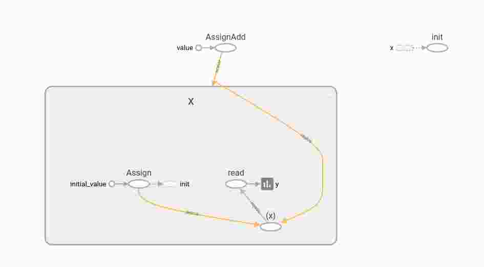
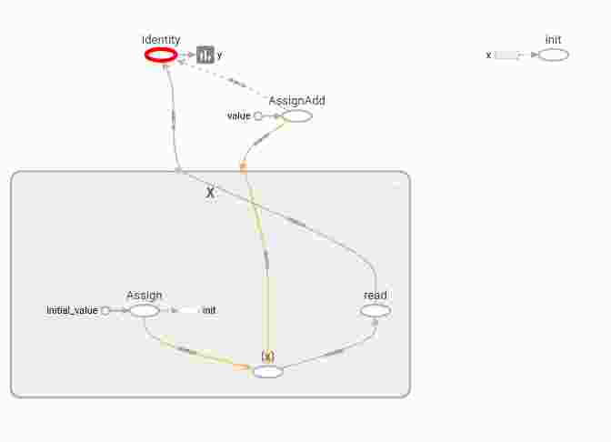
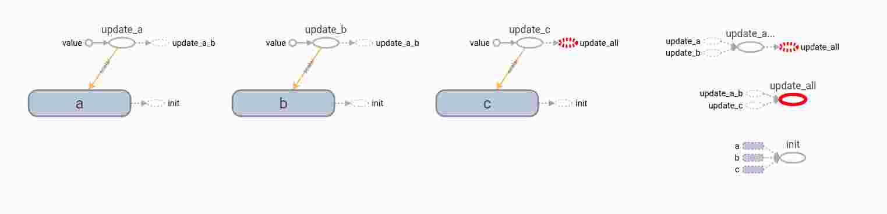

撰写时间：2017.08.31

撰写内容：使用tensorflow实现batch normalization


**写在开头:batch normalization不是很难的内容，但是如果不自己通过一些低级的API实现总会觉得有些细节很难触碰到，所以下面的内容就是如何使用tensorflow实现batch normalization。**

文章分为两部分：

1.实现过程中使用的API，**务必在实现之前了解这些api的使用**

2.实现batch normalization，**代码来自于stackoverflow上面的一个回答。**

代码是否可用，并没有测试。我也是今天早上做项目的时候需要使用bn，所以花了一天时间，边学习，边记录才有了这篇博文。对于文中API解释不清楚的，可以搜一搜tensorflow的官方问答，或者其他博文。最后所有的测试代码，可以从我的github地址上下载（还没上传。。）


# tensorflow API

## assign
返回值是op，而不是tensor
1.tf.assign()
2.tf.assign_sub()
3.tf.assign_add()

## dependency

1.tf.control_dependency()

人为的在两个操作之间添加关联关系

```python
with tf.control_dependency([op1,...])
	op2
```

即op2是依赖于op1的，在运行op2时需要调用op1

2.tf.identity()

Return a new tensor with the same shape and contents as the input tensor or value.


```python
import tensorflow as tf
x = tf.Variable(0.0)
x_plus_1 = tf.assign_add(x, 1)

with tf.control_dependencies([x_plus_1]):
    y = tf.identity(x)
    #y = x


init = tf.global_variables_initializer()

with tf.Session() as session:
    init.run()
    for i in xrange(5):
        print(y.eval())
```

with "y=x",并不会创建变量，而且不是op，所以tf.control_dependencies并不会生效。

with "y=tf.identity(x)"，每次取y的值，x都会自动加1

## ExponentialMovingAverage
### 1.apply()

1.adds shadow copies of trained variables
2.add ops that maintain a moving average of the trained variables

调用形式
```python
with tf.control_dependencies([op1]):
	ema_op = ema.apply([var1])
```
注:op1是更新变量var1的，然后先储存var1修改前的变量值，shadow variables。然后执行op1，取出修改后变量为variable。最后创建一个更新shadow variables的op，

shadow_variable = decay * shadow_variable + (1 - decay) * variable


### 2.average()
Returns the Variable holding the average of var.
取出apply中计算的值

```python
import tensorflow as tf
w = tf.Variable(1.0)
b = tf.Variable(1.0)
ema = tf.train.ExponentialMovingAverage(0.9)
#使add操作的返回值为op，而不是数值
#如果是数值，那么control_dependency就不能依赖了
update_w = tf.assign_add(w, 1.0)
update_b = tf.assign_sub(b, 0.1)

with tf.control_dependencies([update_w,update_b]):
    #返回一个op,这个op用来更新moving_average,i.e. shadow value
    ema_op = ema.apply([w,b])#这句和下面那句不能调换顺序
    #1.adds shadow copies of trained variables
    #2.add ops that maintain a moving average of the trained variables

# 以 w 当作 key， 获取 shadow value 的值
ema_w_val = ema.average(w)#参数不能是list，有点蛋疼
#ema_b_val = ema.average(b)
tf.summary.scalar("w",ema_w_val)
merged_summary_op = tf.summary.merge_all()


with tf.Session() as sess:
    tf.global_variables_initializer().run()
    if tf.gfile.Exists("/tmp/mnist_logs"):
        tf.gfile.DeleteRecursively("/tmp/mnist_logs");
    summary_writer = tf.summary.FileWriter('/tmp/mnist_logs',sess.graph)    
    
    for i in range(3):
    	#先运行该操作，由于dependency，所以会更新w的值
        sess.run(ema_op)
        #取出计算的结果
        print(sess.run(ema_w_val))
        #print(sess.run(ema_b_val))
        summary_str = sess.run(merged_summary_op)
        summary_writer.add_summary(summary_str, i);
    
#输出所有的apply中的变量，这个例子为[w,b]
    print tf.get_collection(tf.GraphKeys.MOVING_AVERAGE_VARIABLES)
# 创建一个时间序列 1 2 3 4
#输出：
#1.1      =0.9*1 + 0.1*2
#1.29     =0.9*1.1+0.1*3
#1.561    =0.9*1.29+0.1*4
```


当然非常重要的一点就是apply是否必须与control_dependency()一起用，答案当然是否定的。下面代码的返回值也是1.561.
```python
import tensorflow as tf
w = tf.Variable(1.0,name='w')
ema = tf.train.ExponentialMovingAverage(0.9)
update_w = tf.assign_add(w, 1.0)
ema_op = ema.apply([w])
#1.adds shadow copies of trained variables
#2.add ops that maintain a moving average of the trained variables
# 以 w 当作 key， 获取 shadow value 的值
ema_w_val = ema.average(w)#参数不能是list，有点蛋疼
with tf.Session() as sess:
    for i in range(3):
        sess.run(update_w)
        sess.run(ema_op) 
    print(sess.run(ema_w_val))
# 创建一个时间序列 1 2 3 4
#输出：
#1.1      =0.9*1 + 0.1*2
#1.29     =0.9*1.1+0.1*3
#1.561    =0.9*1.29+0.1*4
```

依照此可以推出apply的工作方式为：
在图中的定义阶段apply函数就会将其传入的**所有list中的变量**的值储存起来，也就是所有变量的shadow variables。此后在session中调用apply操作时的时候，先取出该变量对应的新值，然后根据公式更新shadow variables。

## Group
将多个操作group成一个操作

```python
import tensorflow as tf
if tf.gfile.Exists("/tmp/mnist_logs"):
    tf.gfile.DeleteRecursively("/tmp/mnist_logs");
a = tf.Variable(0.1,name='a')
b = tf.Variable(0.2,name='b')
c = tf.Variable(0.3,name='c')
update_a = tf.assign_add(a,1,name='update_a')
update_b = tf.assign_sub(b,0.01,name='update_b')
update_c = tf.assign_add(c,1,name='update_c')
update = tf.group(update_a,update_b,name="update_a_b")
with tf.control_dependencies([update_c]):
    update_c = tf.group(update,name="update_all")
tf.summary.scalar("a",a)
merged_summary_op = tf.summary.merge_all() 
init = tf.global_variables_initializer()
session = tf.Session()
session.run(init)
summary_writer = tf.summary.FileWriter('/tmp/mnist_logs',session.graph)
session.run(update_c)
print session.run(a)
print session.run(b)
print session.run(c)
summary_str = session.run(merged_summary_op)
summary_writer.add_summary(summary_str,0)
```

update操作就是update_a和update_b操作的group的结果

这个例子中也在尝试这探索control_dependency和group之间的关系。stackoverflow question
[DIfference between tf.control_dependency() and tf.group()](https://stackoverflow.com/questions/41780655/difference-between-tf-group-and-tf-control-dependencies)

```
#c = tf.group(a,b)

with tf.control_dependencies([a, b]):
    c = tf.no_op() #定义一个空操作
```
上面代码的计算图，可以看出所有的op之间的依赖关系



# batch normalization
**当你看到了这里，我希望你上面所有的api都弄懂了，诚然这篇博文写的不怎么样，不详细，可能很多我自己理解的东西无法用语言表达出来，所以就需要你自己根据文章脉络去搜其他详细的博文来学习。所以如果你对上面的那些api都特别熟悉，那么下面的这段代码对你来说要是很简单的就能看懂。**
```python
"""A helper class for managing batch normalization state.                   

This class is designed to simplify adding batch normalization               
(http://arxiv.org/pdf/1502.03167v3.pdf) to your model by                    
managing the state variables associated with it.                            

Important use note:  The function get_assigner() returns                    
an op that must be executed to save the updated state.                      
A suggested way to do this is to make execution of the                      
model optimizer force it, e.g., by:                                         

  update_assignments = tf.group(bn1.get_assigner(),                         
                                bn2.get_assigner())                         
  with tf.control_dependencies([optimizer]):                                
    optimizer = tf.group(update_assignments)                                

"""

import tensorflow as tf


class ConvolutionalBatchNormalizer(object):
      """Helper class that groups the normalization logic and variables.        

      Use:                                                                      
          ewma = tf.train.ExponentialMovingAverage(decay=0.99)                  
          bn = ConvolutionalBatchNormalizer(depth, 0.001, ewma, True)           
          update_assignments = bn.get_assigner()                                
          x = bn.normalize(y, train=training?)                                  
          (the output x will be batch-normalized).                              
      """

    def __init__(self, depth, epsilon, ewma_trainer, scale_after_norm):
        self.mean = tf.Variable(tf.constant(0.0, shape=[depth]),
                                trainable=False)
        self.variance = tf.Variable(tf.constant(1.0, shape=[depth]),
                                    trainable=False)
        self.beta = tf.Variable(tf.constant(0.0, shape=[depth]))
        self.gamma = tf.Variable(tf.constant(1.0, shape=[depth]))
        self.ewma_trainer = ewma_trainer
        self.epsilon = epsilon
        self.scale_after_norm = scale_after_norm

    def get_assigner(self):
        """Returns an EWMA apply op that must be invoked after optimization."""
        #在optimization之后必须被调用
        return self.ewma_trainer.apply([self.mean, self.variance])

    def normalize(self, x, train=True):
        """Returns a batch-normalized version of x."""
        if train:
            mean, variance = tf.nn.moments(x, [0, 1, 2])
            #将mean的值赋值给self.mean
            assign_mean = self.mean.assign(mean)
            assign_variance = self.variance.assign(variance)
            with tf.control_dependencies([assign_mean, assign_variance]):
                return tf.nn.batch_normalization(
                    x, mean, variance, self.beta, self.gamma,
                    self.epsilon, self.scale_after_norm)
        else:
            mean = self.ewma_trainer.average(self.mean)
            variance = self.ewma_trainer.average(self.variance)
            local_beta = tf.identity(self.beta)
            local_gamma = tf.identity(self.gamma)
            return tf.nn.batch_normalization(
                x, mean, variance, local_beta, local_gamma,
                self.epsilon, self.scale_after_norm)
```

batch normalization的代码，对于训练过程是很简单的，也就是首先通过调用tensorflow的api，tf.batch_norm(x)函数将x变换到y。然后通过简单的链式法则求梯度，然后选择一种梯度更新的方法进行参数更新$(\gamma,\beta)$.

但是对于test过程，我们需要利用在训练过程中的变量mean和variance，假设有train_step=10000，那么我们就有了10000个mean和variance.论文中提到的是使用ExponentialMovingAverage，滑动平均，也就是在train的过程中**每一次gradient更新之后都要根据新的mean和variance的值计算shadow variable。（ExponentialMovingAverage更新，这个更新是为了测试过程中能够使用训练集的mean和variance，而和传统的参数更新，如：$\gamma \beta$，并没有什么联系）**然后在test的过程中利用最后的mean和variance做计算！！！


如何使用这个函数，在注释中作者已经详细给出了

```python
#先在层中使用这个类
ewma = tf.train.ExponentialMovingAverage(decay=0.99)                  
bn = ConvolutionalBatchNormalizer(depth, 0.001, ewma, True)           
update_assignments = bn.get_assigner()                                
x = bn.normalize(y, train=training?)
#x 就是normalization后的量

...

#定义mean和variance的更新(ExponentialMovingAverage)
#
update_assignments = tf.group(bn1.get_assigner(),                         
                                bn2.get_assigner())                         
with tf.control_dependencies([optimizer]):                                
	optimizer = tf.group(update_assignments)
```

[How could i use batch normalization in tensorflow?---stackoverflow 地址](https://stackoverflow.com/questions/33949786/how-could-i-use-batch-normalization-in-tensorflow)


